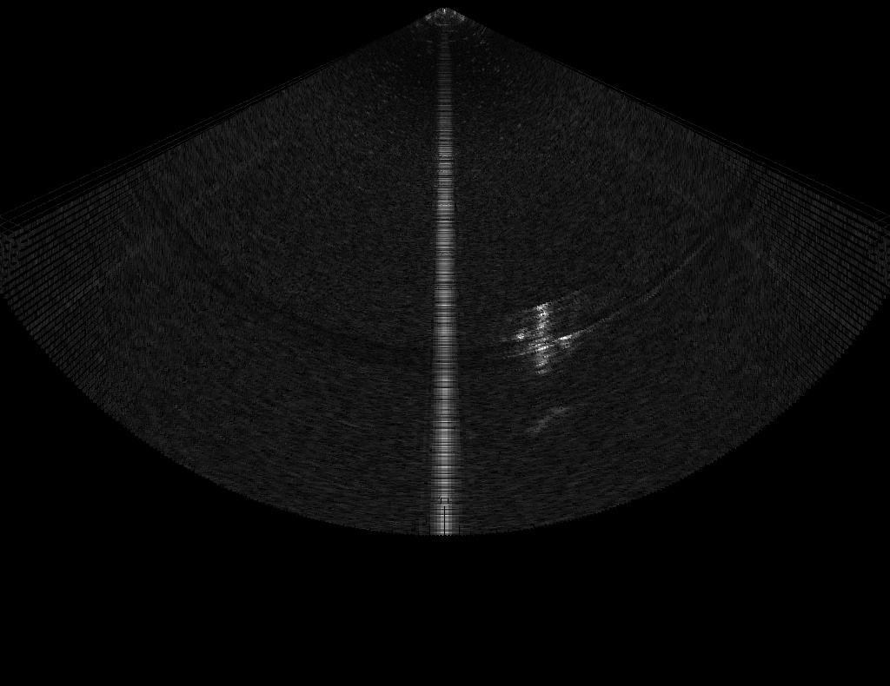
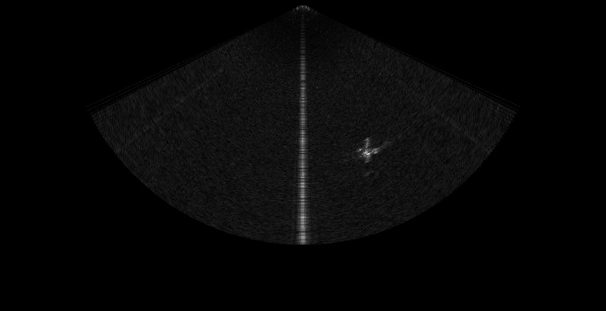
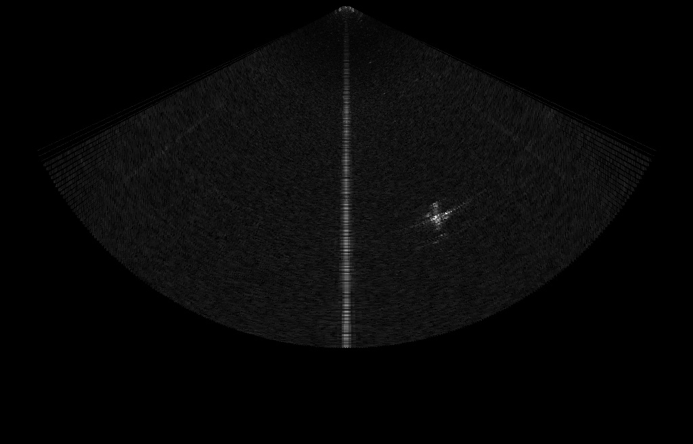
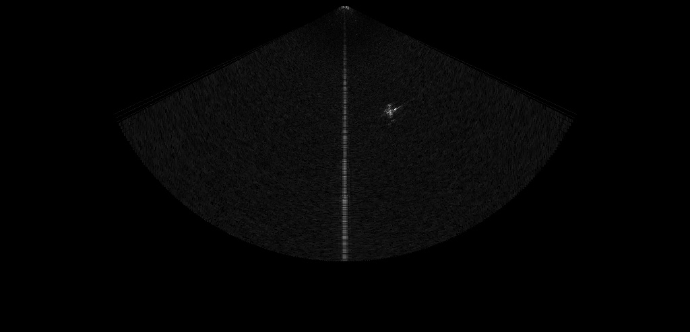
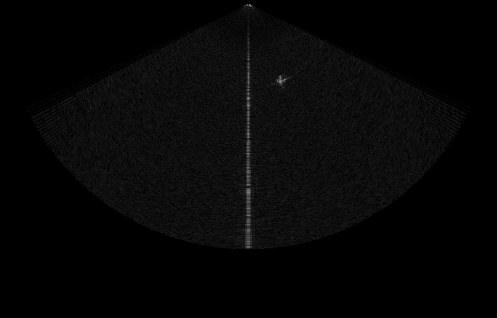
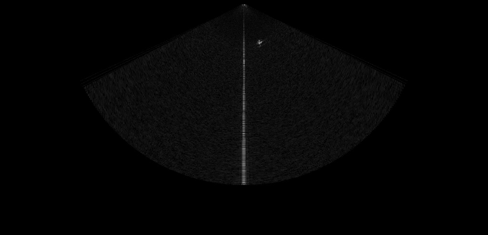
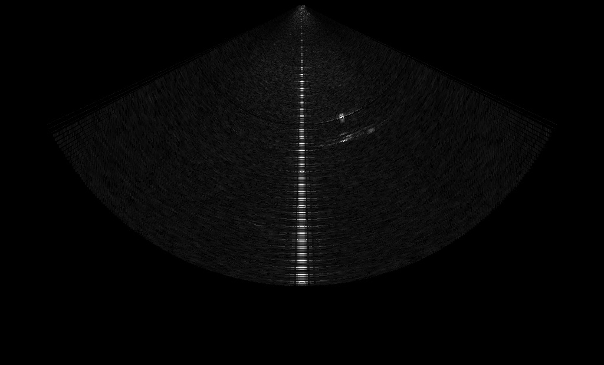
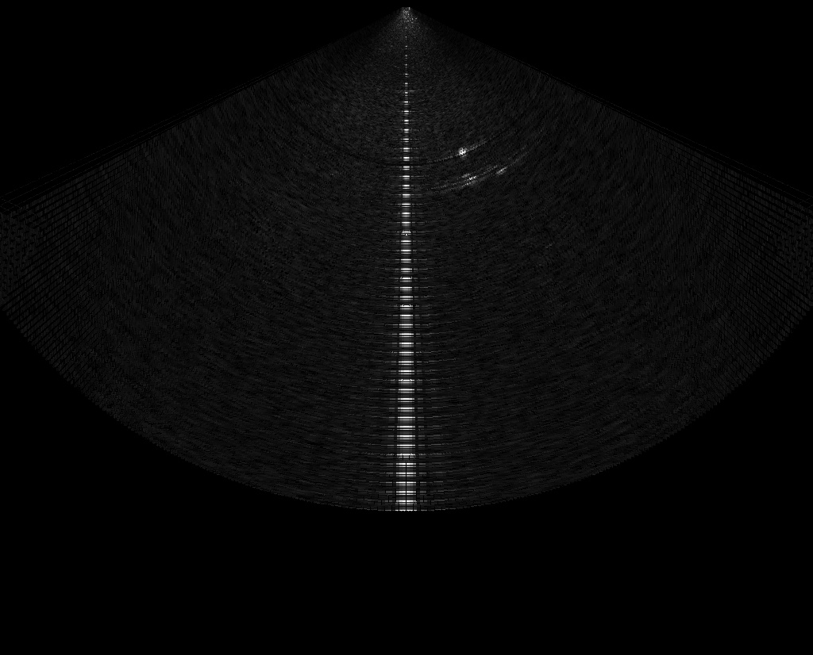

# LSOD

### A Long-Range Forward-Looking Sonar Object Dataset

---

## Dataset Download

The LSOD dataset can be downloaded from Baidu Netdisk:

- **File:** `LSOD-Dataset.zip`
- **Link:** [https://pan.baidu.com/s/1-_HiJA2GwqgDaHQVUDMPuw](https://pan.baidu.com/s/1-_HiJA2GwqgDaHQVUDMPuw)
- **Extraction code:** `7jnm`

## Overview

LSOD is a forward-looking sonar dataset collected from underwater scanning scenarios. The dataset contains sonar images captured at different scanning distances, including **3 m, 4 m, 5 m, 7 m, 10 m, 15 m, 30 m, and 40 m**.

These samples demonstrate a key challenge in real underwater search scenarios: as the scanning distance increases, the target becomes smaller and less distinguishable in sonar imagery. Therefore, long-range underwater search faces a serious **small-target detection** problem.

Our code and dataset will continue to be updated in this project. We have also uploaded several representative samples from the dataset for preview.

## Sample Images

<table>
  <tr>
    <td align="center">
       
      <b>Figure 1.</b> Imaging at a scanning distance of <b>3 m</b>
    </td>
    <td align="center">
       
      <b>Figure 2.</b> Imaging at a scanning distance of <b>4 m</b>
    </td>
  </tr>
  <tr>
    <td align="center">
       
      <b>Figure 3.</b> Imaging at a scanning distance of <b>5 m</b>
    </td>
    <td align="center">
       
      <b>Figure 4.</b> Imaging at a scanning distance of <b>7 m</b>
    </td>
  </tr>
  <tr>
    <td align="center">
       
      <b>Figure 5.</b> Imaging at a scanning distance of <b>10 m</b>
    </td>
    <td align="center">
       
      <b>Figure 6.</b> Imaging at a scanning distance of <b>15 m</b>
    </td>
  </tr>
  <tr>
    <td align="center">
       
      <b>Figure 7.</b> Imaging at a scanning distance of <b>30 m</b>
    </td>
    <td align="center">
       
      <b>Figure 8.</b> Imaging at a scanning distance of <b>40 m</b>
    </td>
  </tr>
</table>

## Notes

The examples above show that the imaging size and visual clarity of the target decrease as the scanning distance becomes larger. This makes LSOD suitable for studying long-range underwater object detection and small-target recognition in forward-looking sonar images.

